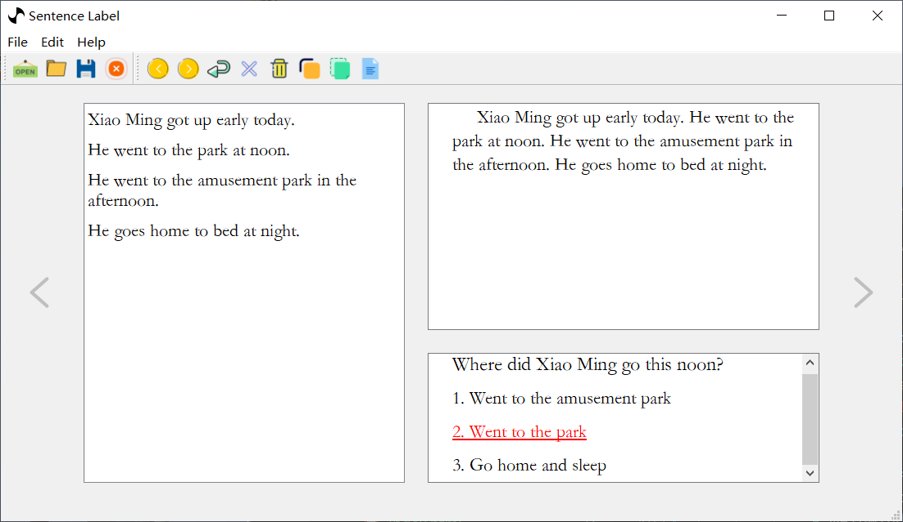
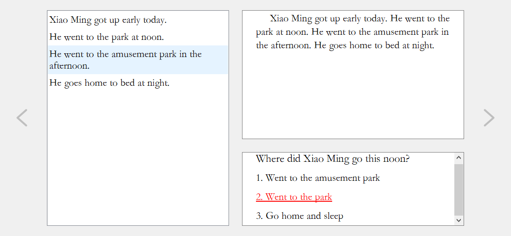

# 简介

这是一个给 `多项选择` 打标的软件。也就是可以通过这个软件标注支持 `多项选择` 答案的句子。如：

```
文章：
小明今天起的很早。中午去了公园。下午去了游乐园。晚上回家睡觉。

问题：
小明今天中午去了哪里。

答案：
A: 去了游乐园
B: 去了公园
C: 回家睡觉
```

对于以上文章我们能够准确的选出 `B` 这个选项。但是在机器做阅读理解任务时，机器并不能明确的知道，是通过那句话推理出这个答案的。就算我们告诉了机器 `B` 这个选项，机器也不一定能够在原文中正确的找出回答这个问题所依赖的句子。

对于上述问题在原文中所依赖的句子应该是 `中午去了公园。` 这句话。而想要机器快速准确的找到这句话，我们有一种解决途径是给这句话打上标签。然后在训练模型时告诉模型这个关键信息，这样模型才有可能准确的定位到回答问题所依赖的句子。

## 教程地址

[教程地址](http://www.myhwx.com/sentenceLabel)

## 安装

1. `pip` 安装
 
通过在终端执行  `pip install sentenceLabel` 即可完成安装

2. 源码安装

下载源码，在源码目录中执行 `python setup.py install` 即可完成安装 

3. 运行
  
终端执行 `sentence-label` 就可以运行此软件了

> 当上面的命令不能运行此软件时可以执行下面的 `Python` 代码来使用本软件

```python
from sentenceLabel import sentenceLabel
import sys
sys.exit(sentenceLabel.main())
```


## 界面介绍

1. 整体界面



2. 菜单栏


从左到右菜单的功能为

 + 打开需要打标的文件
 + 保存文件
 + 文件另存为
 + 关闭当前打开的文件
 + 向前移动一篇文章
 + 向右移动一篇文章
 + 移动到指定文章
 + 删除当前文章的标签
 + 删除所有文章的标签
 + 拷贝当前文章
 + 粘贴一篇文章到打开的文件里面
 + 文档

3. 窗口主体



左边是文章切分出来的句子，右上是完整的文章，右下是问题和答案。两侧分别是前一篇文章和后一篇文章的按钮。
