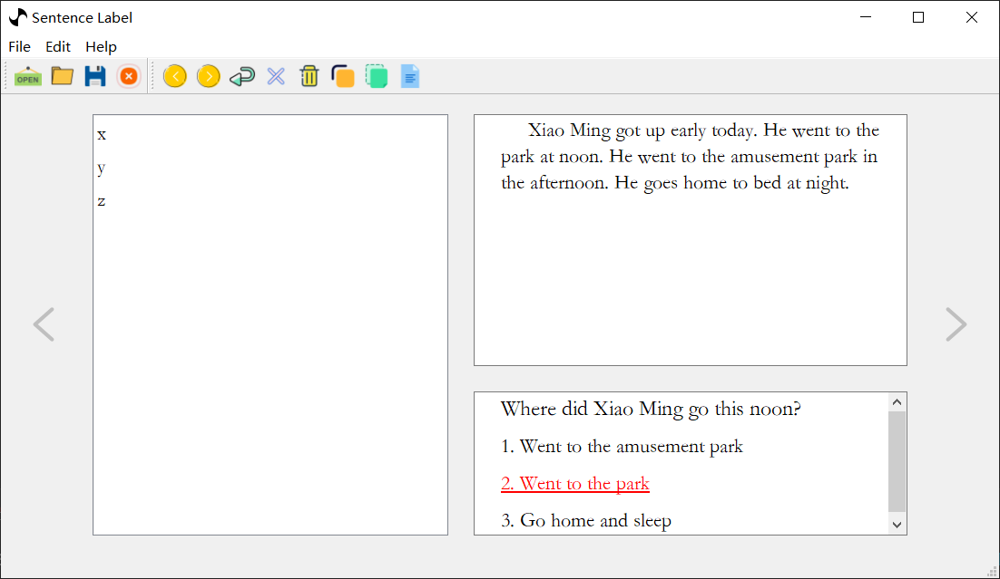
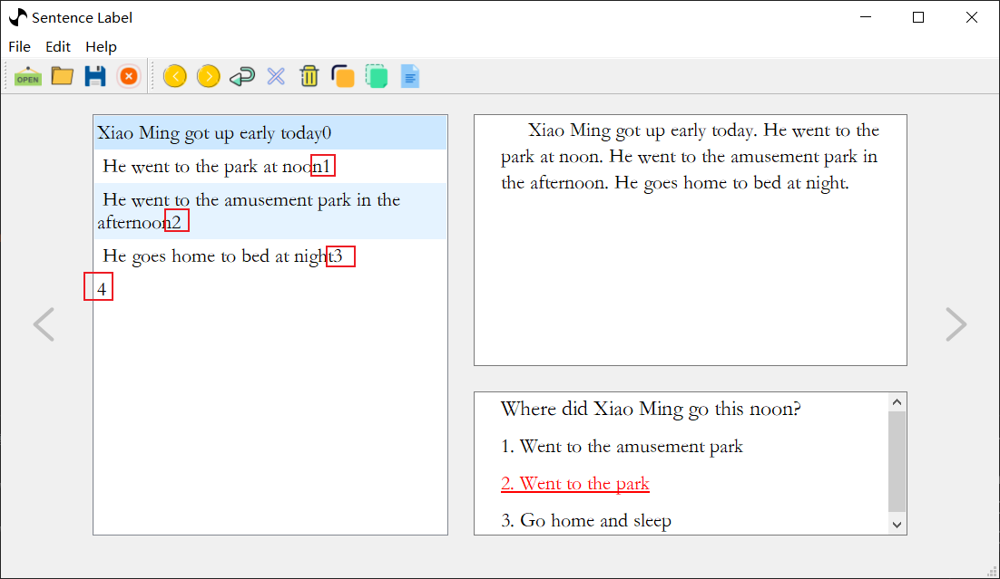

# 自定义文章切分方式

通过上面的讲解，我们了解到本软件是把文章切分为一个个句子然后再打标的。但是这往往满足不了所有场景，有时候在打标时可能需要一些个性化切分方式，所以我们需要自定义一个方法对文章进行切分。

1. 下面是把文章切分为单词的方法（这应该不是很实用，这里仅当做例子讲解，可以通过这个例子扩展出无数总方法）

```json
{
    "segmentation":"sent_list=article.split(' ')",
    "data": [
        {
            "answer": 1,
            "options": [
                "Went to the amusement park",
                "Went to the park",
                "Go home and sleep"
            ],
            "question": "Where did Xiao Ming go this noon?",
            "article": "Xiao Ming got up early today. He went to the park at noon. He went to the amusement park in the afternoon. He goes home to bed at night."
        }
    ]
}
```

通过对比快速开始中我们的数据文件，仅仅加了一个字段 `segmentation` 就完成了把文章切分成单词如下图所示。


+ `sent_list=article.split(' ')` 是怎么工作的

首先这句 `Python` 代码是把 `article` 通过 `空格` 进行切分，并用 `sent_list` 变量进行接收。

通过对 `Python` 代码的理解我们可以知道，其实只要在 `segmentation` 字段后面通过 `sent_list` 变量来返回一个字符串list，就能在句子区域显示出来。不妨再做一个实验如下：

```json
{
    "segmentation":"sent_list=['x', 'y', 'z']",
    "data": [
        {
            "answer": 1,
            "options": [
                "Went to the amusement park",
                "Went to the park",
                "Go home and sleep"
            ],
            "question": "Where did Xiao Ming go this noon?",
            "article": "Xiao Ming got up early today. He went to the park at noon. He went to the amusement park in the afternoon. He goes home to bed at night."
        }
    ]
}
```

+ 这里我们直接定义 `sent_list` 等于 `['x', 'y', 'z']` 这个 list 通过图片我们可以看出确实显示出来了。



+ 回归主题我们现在讨论的是怎么切分一篇文章
 
显然首先要拿到文章，我们可以看见 `data` 字段下，文章部分是用 `article` 这个字段保存的。也就是说我们可以在 `segmentation` 字段所对应的代码中直接使用 `article` 这个参数来表示文章，这样就能理解 `sent_list=article.split(' ')` 这句代码为什么这么写了

2. `segmentation` 字段不仅仅可以包含一句代码，其实他可以包含无穷代码，所以怎么切分文章就看各位的想象力了
   
+ 来点并没有用途的多行代码切分文章（主要为了展示怎么用多行代码切割文章）

```json
{
    "segmentation":"sent_list=article.split('.')\nfor i in range(len(sent_list)):\n    sent_list[i] += str(i)",
    "data": [
        {
            "answer": 1,
            "options": [
                "Went to the amusement park",
                "Went to the park",
                "Go home and sleep"
            ],
            "question": "Where did Xiao Ming go this noon?",
            "article": "Xiao Ming got up early today. He went to the park at noon. He went to the amusement park in the afternoon. He goes home to bed at night."
        }
    ]
}
```

看出上面代码所表达的效果没有嘻嘻嘻

```python
sent_list=article.split('.')
for i in range(len(sent_list)):
    sent_list[i] += str(i)
```




