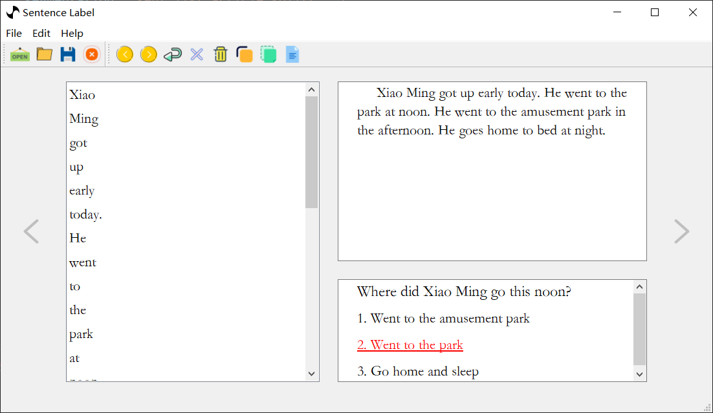

# 配置

+ 配置格式

```json
{
    "config": {},
    "data":[]
}
```

数据文件中的 `config` 字段是我们添加配置的字段，里面包含了一些基本的配置参数（都是替换数据格式名字的）。

+ 原始数据文件格式
  
```json
{
    "data": [
        {
            "answer": "str or int",
            "options": [
                "str",
                "..."
            ],
            "question": "str",
            "article": "str"
        }
    ]
}
```

+ 通过配置项更改后的数据格式

```json
{
    "config": {
        "answer": "a",
        "options": "o",
        "question": "q",
        "article": "ar",
        "data": "d",
        "number": "n",
        "sentences": "s"
    },
    "d": [
        {
            "a": "str or int",
            "o": [
                "str",
                "..."
            ],
            "q": "str",
            "ar": "str",
            "s": [],
            "n": 0
        }
    ],
    
}
```

+ 新建 `test.json` 复制下面的数据我们来看看效果吧

```json
{
    "config": {
        "answer": "a",
        "options": "o",
        "question": "q",
        "article": "ar",
        "data": "d",
        "number": "n",
        "sentences": "s"
    },
    "data": [
        {
            "a": 1,
            "o": [
                "Went to the amusement park",
                "Went to the park",
                "Go home and sleep"
            ],
            "q": "Where did Xiao Ming go this noon?",
            "ar": "Xiao Ming got up early today. He went to the park at noon. He went to the amusement park in the afternoon. He goes home to bed at night."
        }
    ]
}
```

+ 效果图片如下
  


+ 我们选中正确的句子然后保存一下看看保存下来数据格式和我们想象的是否一样

```json
{
    "config": {
        "answer": "a",
        "options": "o",
        "question": "q",
        "article": "ar",
        "data": "d",
        "number": "n",
        "sentences": "s"
    },
    "d": [
        {
            "a": 1,
            "o": [
                "Went to the amusement park",
                "Went to the park",
                "Go home and sleep"
            ],
            "q": "Where did Xiao Ming go this noon?",
            "ar": "Xiao Ming got up early today. He went to the park at noon. He went to the amusement park in the afternoon. He goes home to bed at night.",
            "s": [
                "He went to the park at noon."
            ],
            "n": 1
        }
    ]
}
```

从上面的数据我们可以看出确实用 `s` 字段保存了我们打标的句子，用 `n` 字段保存了打标句子的数量

## 配置项解释

```json
{
    "config": {
        "answer": "答案字段名字",
        "options": "选项字段名字",
        "question": "问题字段名字",
        "article": "文章字段名字",
        "data": "数据字段名字",
        "number": "数量字段名字",
        "sentences": "打标保存句子字段名字"
    }
}
```

## 其他配置

当阅读完文章[自定义切分方式](./article-segmentation.md)之后，我们知道可以通过自己编写代码来切分文章变成句子。其中需要两个参数 `article` 和 `sent_list`，第一个参数代表文章字符串，第二个参数是返回给软件调用的 `list`。又由于前面配置的讲解，我们知道了可以通过 `{"config":{"article":"文章名字"}}` 这样的做法来改变参数一 `article` 的名字，那么参数二 `sent_list` 怎么改变呢。我们提供了一个字段 `sentName` 来更改它的名字如下。

```json
{
    "sentName":"xxx",
    "segmentation":"xxx=article.split(' ')",
    "data": [
        {
            "answer": 1,
            "options": [
                "Went to the amusement park",
                "Went to the park",
                "Go home and sleep"
            ],
            "question": "Where did Xiao Ming go this noon?",
            "article": "Xiao Ming got up early today. He went to the park at noon. He went to the amusement park in the afternoon. He goes home to bed at night."
        }
    ]
}
```

+ 效果如下

