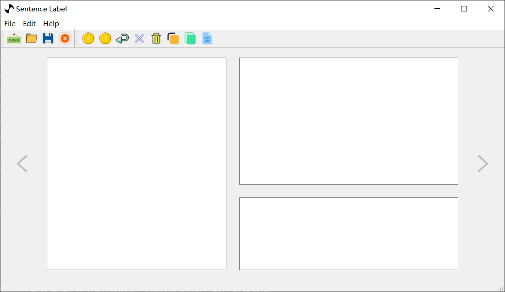

# 复制粘贴

## 复制

复制快捷键是 `Ctrl+C`，作用很简单就是把当前编辑的文章问题答案等全复制到剪切板。如下文章。


+ 复制出来的结果

```json
{
    "answer": 1,
    "options": [
        "Went to the amusement park",
        "Went to the park",
        "Go home and sleep"
    ],
    "question": "Where did Xiao Ming go this noon?",
    "article": "Xiao Ming got up early today. He went to the park at noon. He went to the amusement park in the afternoon. He goes home to bed at night."
}
```

## 粘贴

粘贴顾名思义就是把剪切板里面的内容粘贴到页面（快捷键`Ctrl+V`）。我们可以打开一个空白的窗口，复制上面 Copy 出来的内容，然后粘贴。

+ 空白页面



+ 粘贴后出来的效果


> 这个软件的粘贴功能是定制的，只能粘贴和数据格式一样的 `Json` 数据到面板。
