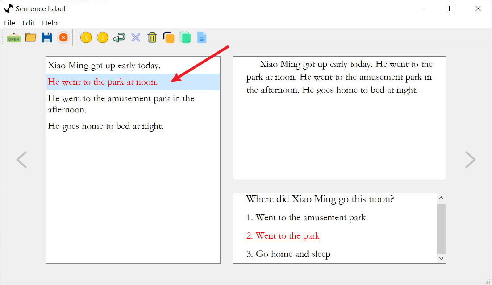
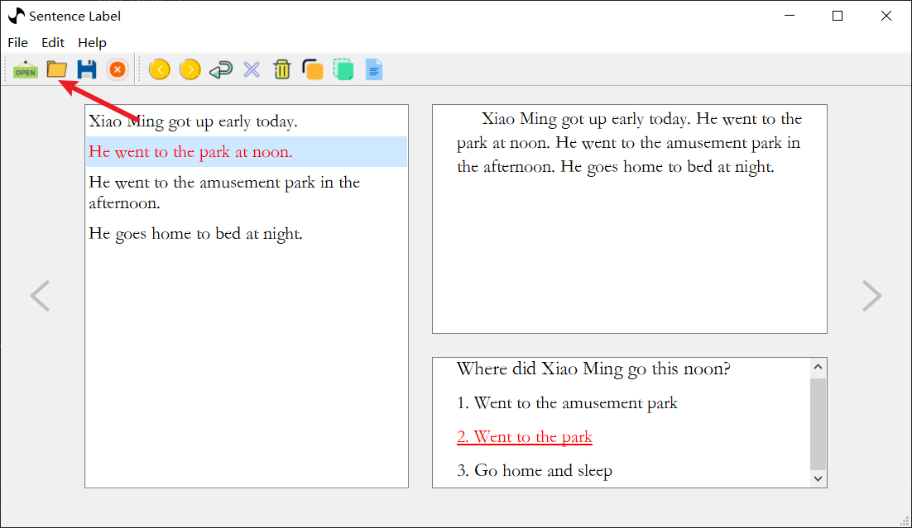

# 快速开始

1. 新建 `test.json` 文件，粘贴下面 `json` 数据。

```json
{
    "data": [
        {
            "answer": "B",
            "options": [
                "Went to the amusement park",
                "Went to the park",
                "Go home and sleep"
            ],
            "question": "Where did Xiao Ming go this noon?",
            "article": "Xiao Ming got up early today. He went to the park at noon. He went to the amusement park in the afternoon. He goes home to bed at night."
        }
    ]
}
```

2. 用 `Sentence Label` 打开刚才新建的 `Json` 文件。得到的效果如下图所示


3. 然后通过点击左侧窗口句子来标记当前问题所依赖的文章中的句子



4. 点击保存按钮或者 `Ctrl+S` 来保存刚打的标签
   


5. 我们来看看 `test.json` 文件中增加了那些内容
   
```json
{
    "data": [
        {
            "answer": "B",
            "options": [
                "Went to the amusement park",
                "Went to the park",
                "Go home and sleep"
            ],
            "question": "Where did Xiao Ming go this noon?",
            "article": "Xiao Ming got up early today. He went to the park at noon. He went to the amusement park in the afternoon. He goes home to bed at night.",
            "sentences": [
                "He went to the park at noon."
            ],
            "number": 1
        }
    ]
}
```

我们可以看到上面 `Json` 文件中增加了 `sentences` 和 `number` 项，其中 `sentences` 表示我们刚才打的标签，`number` 表示打标的数量。也就是说一个问题可能依赖文章中的几句话，你可以在打标栏点击所有所依赖的句子，这些句子都会被标记。当然别忘了保存标签哟！！！